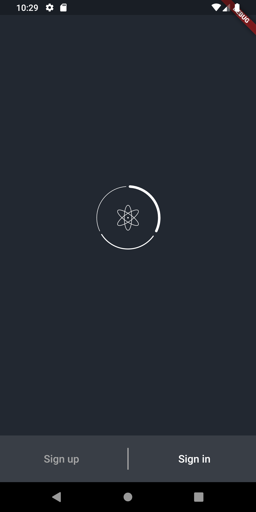
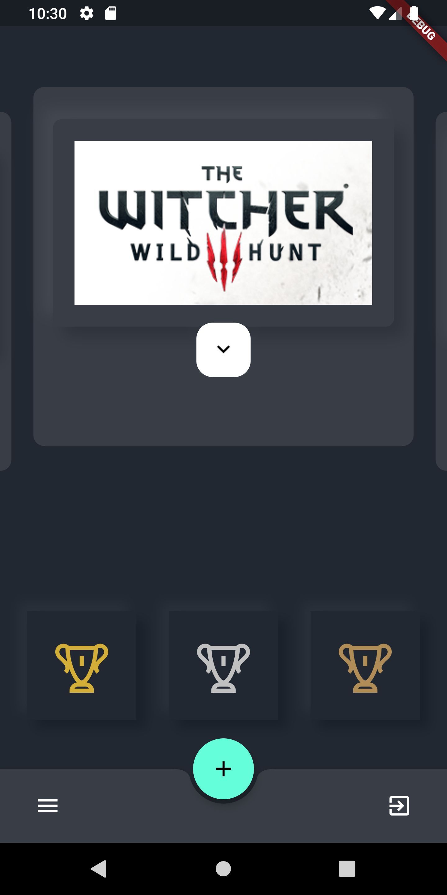
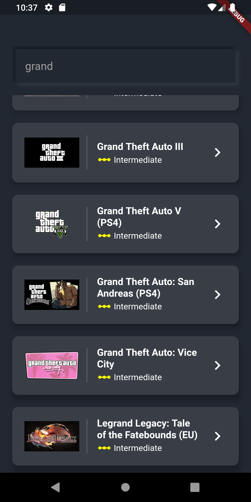
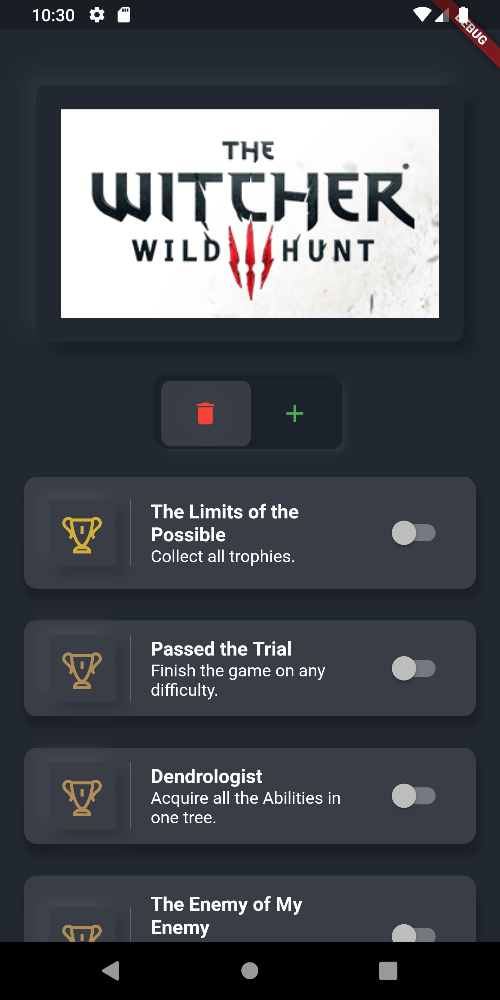

# COMPLETIONIST

<a href="https://play.google.com/store/apps/details?id=co.turingcreatives.game_trophy_manager"></a>

**Completionist build in Flutter**

"Completionist" is a app that tracks in-game progress in PS4 and Xbox One Games. Tracks all the achieved trophies and provides helpful tips and tricks to achieve the test

## Usage

1. Clone the repository from GitHub:

```bash
git clone https://github.com/CCExtractor/rutorrent-flutter
```

2. Navigate to project's root directory:

```bash
cd rutorrent-flutter
```

3. Check for Flutter setup and connected devices:

```bash
flutter doctor
```

5. Run the app:

```bash
flutter run
```

## Contributing

Contribution to the project can be made if you have some improvements for the project or if you find some bugs.
You can contribute to the project by reporting issues, forking it, modifying the code and making a pull request to the repository.

Please make sure you specify the commit type when opening pull requests:

```
feat: The new feature you're proposing

fix: A bug fix in the project

style: Feature and updates related to UI improvements and styling

test: Everything related to testing

docs: Everything related to documentation

refactor: Regular code refactoring and maintenance
```

## License

The project is released under the [MIT License](http://www.opensource.org/licenses/mit-license.php). The license can be found [here](LICENSE).

## Flutter

For help getting started with Flutter, view
[online documentation](https://flutter.dev/docs), which offers tutorials,
samples, guidance on mobile development, and a full API reference.


## Screenshots

  


   
